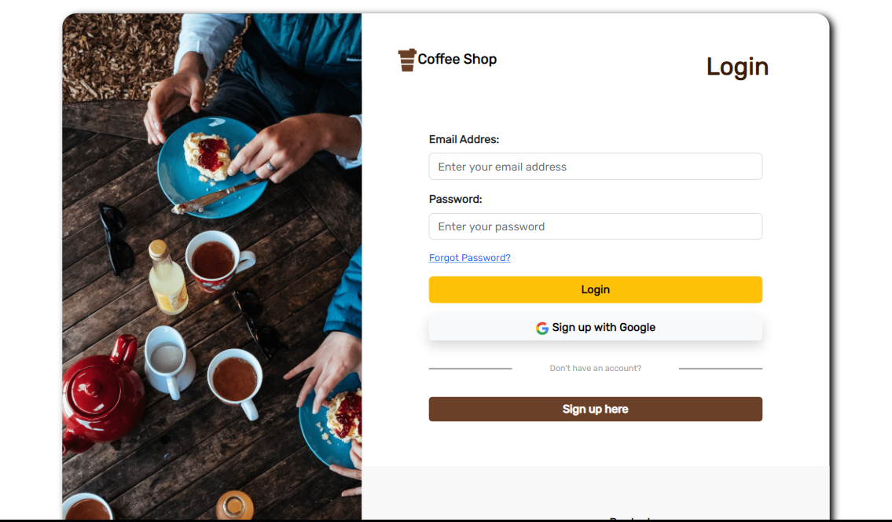
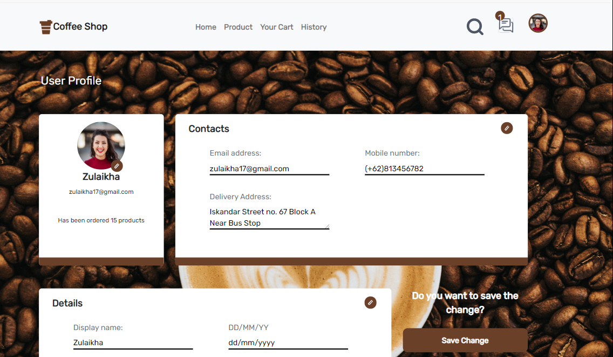

# COFFEE SHOP

## BUILT WITH


## HOW TO INSTALL
1. Clone this 2 repository.
    ```
    $ git clone https://github.com/Zulfahmi321/coffee-shop.git
    $ git clone https://github.com/Zulfahmi321/front-react-coffee-shop.git
    ```
2. Open VS Code or you can download and install it [here](https://code.visualstudio.com/).
3. Open menu **Terminal > New Terminal**

4. On terminal, change directory to **front-react-coffee-shop** then run 
    ```
    npm start
    ```

5. Open another terminal, change directory to **coffee-shop** then run
    ```
    npm start run

## PREVIEW
<div style="display:flex">



</div>
