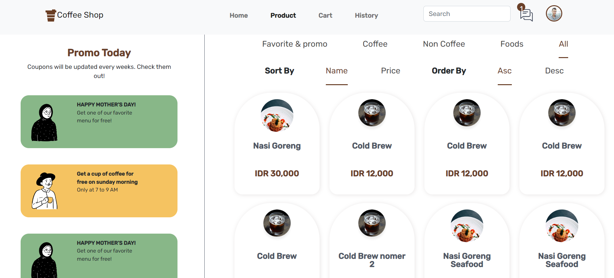

# COFFEE SHOP
<p align="center">
    <br />
    <a href="https://love-coffee-shop.netlify.app/">View Live Application (FRONTEND)</a>
    ·
    <a href="https://github.com/Zulfahmi321/front-react-coffee-shop/issues">Report Bug</a>
    ·
    <a href="https://github.com/Zulfahmi321/front-react-coffee-shop/issues">Request Feature</a>
    ·
    <a href="https://coffee-shop-zul.herokuapp.com/">Related Project App (BACKEND)</a>
  </p>

### BUILT WITH

[](https://nodejs.org/en/)
[](https://expressjs.com/)
[](https://www.postgresql.org/)
<br>


[](https://getbootstrap.com/)
[](https://reactjs.org/)

## Getting Started

### Prerequisites

- [NodeJs](https://nodejs.org/)
- [PostgreSql](https://www.postgresql.org/)
- [Postman](https://www.postman.com/)

## HOW TO INSTALL
1. Clone this 2 repository.
    ```
    $ git clone https://github.com/Zulfahmi321/coffee-shop.git
    $ git clone https://github.com/Zulfahmi321/front-react-coffee-shop.git
    ```
2. Open VS Code or you can download and install it [here](https://code.visualstudio.com/).
3. Open menu **Terminal > New Terminal**

4. On terminal, change directory to **front-react-coffee-shop** then run 
    ```
    npm start
    ```

5. Open another terminal, change directory to **coffee-shop** then run
    ```
    npm start run

## PREVIEW
<div>
<br>
<br>
<br>
<br>
<br>

</div>
